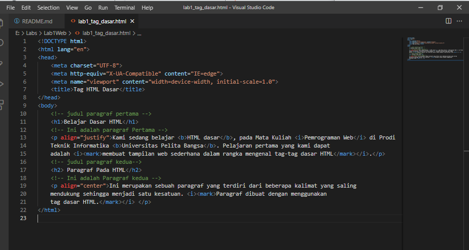
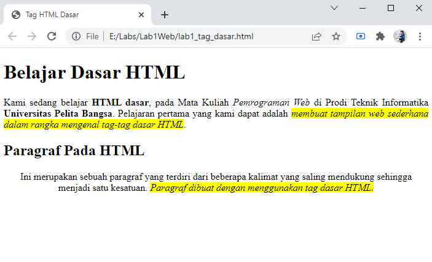
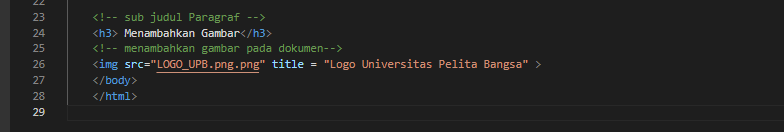
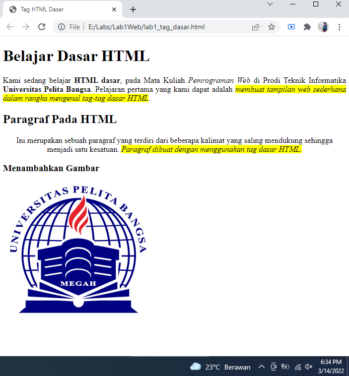
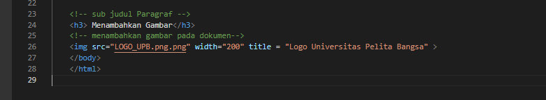
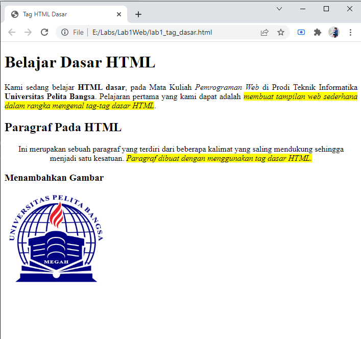
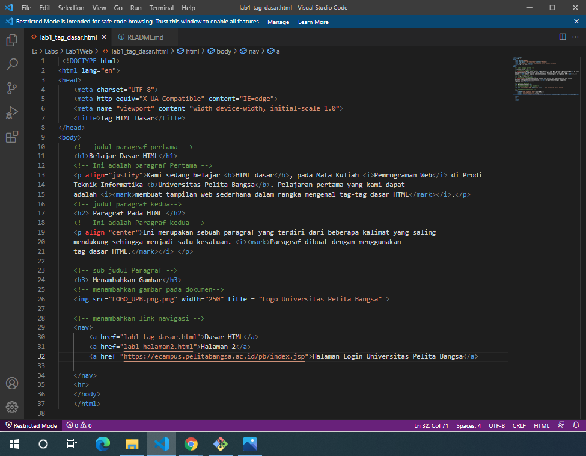
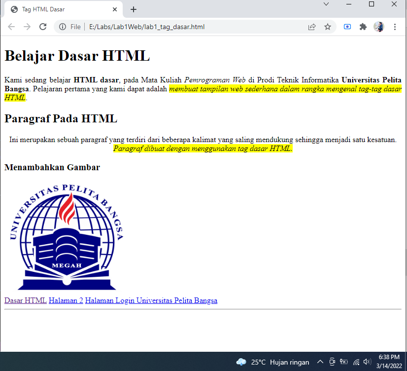

# Lab1Web
## Belajar Tag Dasar HTML

### Membuat Judul Web
Langkah awal untuk membuat website adalah membuat judulnya. 
Kode tag yang digunakan adalah '<title>'
berikut tampilannya 

untuk kodingannya seperti ini 

### Membuat Paragraf 

Langkah selanjutnya adalah membuat paragraf. 
kode tag yang digunakan adalah `
` untuk codingan nya seperti ini

Tampilan di Browser Seperti ini

### Mengatur Atribut Paragraf

Berikut kode untuk mengatur atribut paragraf / align

Rata kanan kiri : `
`

Rata kanan : `
`

Rata kiri : `
`

Rata tengah : `
`

Untuk Codingan nya sebagai berikut.

dan Tampilan di Browser seperti ini, paragraf pertama Menampilkan Rata Tengah
sedangkan paragraf kedua menunjukan Rata Kanan.

### Memberi Judul pada tiap Paragraf

Langkah selanjutnya adalah memberikan judul pada tiap Paragraf
kode yang dipakai adalah `<h>` untuk contoh codingan nya sebagai berikut

Berikut tampilannya di dalam Browser. Paragraf pertama berjudul <b>Belajar Dasar HTML</b> 
dan paragraf kedua berjudul <b>Paragraf Pada HTML</b>.

### Pemformatan Text 

Pemformatan text dilakukan untuk memodifikasi tampilan text pada browser supaya tampilan text lebih menarik.

Untuk kode yang dipakai sebagai berikut :

`<b>` : Bold text

`<strong>` : Important text

`<i>` :Italic text

`<em>` :Emphasized text

`<mark>` :Marked text

`<small>` :Smaller text

`<del>` :Deleted text

`<ins>` :Inserted text

`` :Subscript text

`` :Superscript text

Untuk contoh codingan nya sebagai berikut :

Tampilan Browser nya sebagai berikut :

### Menyisipkan Gambar dan Setting Size Gambar

Untuk menyisipkan gambar, siapkan gambar yang akan disisipkan pada halaman web, 
kemudian simpan file gambar tersebut satu folder dengan file dokumen html. 
Atau bisa juga menyisipkan gambar dari website external. 
Kode tag yang dipakai ``

Codingannya sebagai berikut:

Tampilan Browsernya sebagai berikut :

Gambar akan ditampilkan apa adanya sesuai dengan ukuran aslinya. 
Untuk mengatur ukuran gambar, dapat digunakan atribut witdh dan height dengan nilai integer yang disesuaikan. 
Kode tag yang dipakai ``

Lebih jelasnya lihat contoh berikut :

Tampilan Browsernya sebagai berikut :

### Menambahkan Hyperlink 

Link atau Hyperlink merupakan elemen HTML yang berfungsi untuk menghubungkan satu halaman web dengan halaman web yang lain, 
baik internal maupun eksternal, untuk kode tag nya `<a href="halaman web.html">Halaman web</a>`

Contohnya sebagai berikut :

Tampilan Browsernya :

