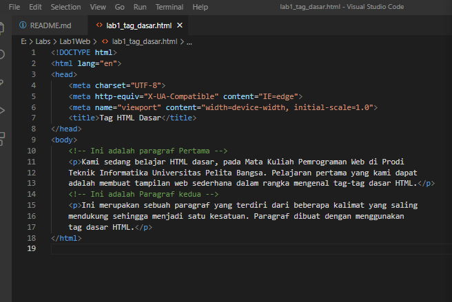

# Lab1Web
## Belajar Tag Dasar HTML

### Membuat Judul Web
Langkah awal untuk membuat website adalah membuat judulnya. 
Kode tag yang digunakan adalah '<title>'
berikut tampilannya 

untuk kodingannya seperti ini 

### Membuat Paragraf 

Langkah selanjutnya adalah membuat paragraf. 
kode tag yang digunakan adalah '
' 
untuk codingan nya seperti ini

tampilan di Browser seperti ini

