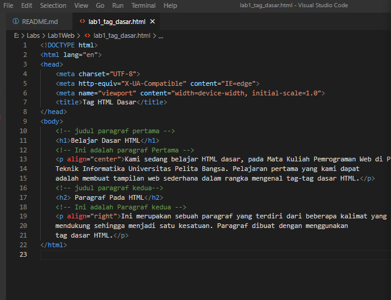

# Lab1Web
## Belajar Tag Dasar HTML

### Membuat Judul Web
Langkah awal untuk membuat website adalah membuat judulnya. 
Kode tag yang digunakan adalah '<title>'
berikut tampilannya 

untuk kodingannya seperti ini 

### Membuat Paragraf 

Langkah selanjutnya adalah membuat paragraf. 
kode tag yang digunakan adalah `
` untuk codingan nya seperti ini

Tampilan di Browser Seperti ini

### Mengatur Atribut Paragraf

Berikut kode untuk mengatur atribut paragraf / align

Rata kanan kiri : `
`

Rata kanan : `
`

Rata kiri : `
`

Rata tengah : `
`

Untuk Codingan nya sebagai berikut.

dan Tampilan di Browser seperti ini, paragraf pertama Menampilkan Rata Tengah
sedangkan paragraf kedua menunjukan Rata Kanan.

### Memberi Judul pada tiap Paragraf

Langkah selanjutnya adalah memberikan judul pada tiap Paragraf
kode yang dipakai adalah `<h>` untuk contoh codingan nya sebagai berikut

Berikut tampilannya di dalam Browser. Paragraf pertama berjudul *Belajar Dasar HTML* 
dan paragraf kedua berjudul *Paragraf Pada HTML*.

